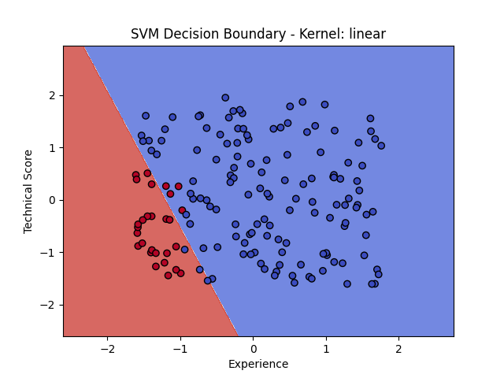
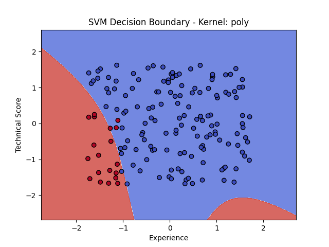
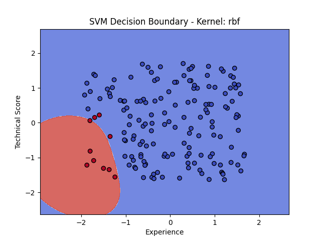
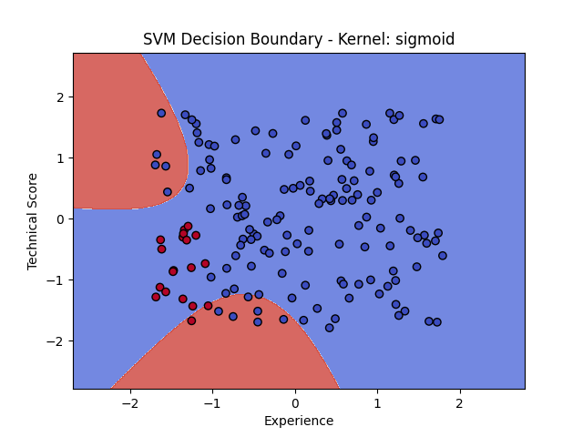

# 🤖 HireWise — Smart Hiring Prediction API

**HireWise** is an intelligent, SVM-powered decision system designed to support hiring teams in evaluating candidates based on their experience and technical skills. By analyzing synthetic or real-world data, HireWise can predict whether a candidate is likely to be successful in a software developer role.

---

## 🚀 Key Features

- 🧪 Generates synthetic candidate data (experience & test score)
- 🧠 Trains a Support Vector Machine (SVM) classifier
- ⚙️ Supports multiple kernel types (`linear`, `rbf`, `poly`, `sigmoid`)
- 💠 Hyperparameter optimization via `GridSearchCV`
- 📈 Visualizes the decision boundary
- 👤 Accepts manual user input for real-time predictions
- 🌐 FastAPI-powered RESTful API for external integration
- 📊 Evaluates performance with metrics like accuracy, confusion matrix, and classification report

---

   

## 🧹 Project Structure

```
hirewise/
├── model.py             # HireWise machine learning model class
├── api_service.py       # FastAPI application class (API endpoints)
├── main.py              # Entry point to launch the API
├── pkl_files/
│   ├── model.pkl        # Saved SVM model
│   └── scaler.pkl       # Saved StandardScaler instance
├── requirements.txt     # Project dependencies
└── README.md            # You are here 🌟
```

---

## 📅 Input Data

Each candidate record contains:
- `experience_years`: Total years of software development experience (0–10)
- `technical_score`: Candidate's score from a technical test (0–100)

---

## 🧠 Labeling Logic

Rule-based labeling is applied to create a training set:

```python
if experience_years < 2 and technical_score < 60:
    label = 1  # Not Hired
else:
    label = 0  # Hired
```

---

## 🧠 ML Model Details

- `SVC` from `scikit-learn` is used to train a Support Vector Machine.
- Feature standardization is applied with `StandardScaler`.
- Kernel is selected by user or via hyperparameter search (`GridSearchCV`).
- The trained model is saved as `model.pkl`, and the scaler as `scaler.pkl`.

---

## ⚙️ Usage Guide

### 1. 📦 Install Requirements

```bash
pip install -r requirements.txt
```

### 2. 🧠 Train the Model

```python
from model import HiringModel

model = HiringModel()
model.grid_search()  # Optional: finds best kernel and hyperparameters
```

### 3. 🌐 Start API Server

```bash
uvicorn main:app --reload
```

### 4. 🔍 Predict Using the API

Visit: [http://127.0.0.1:8000/docs](http://127.0.0.1:8000/docs)

#### Example Request:
```json
POST /predict
{
  "experience_years": 3.5,
  "technical_score": 72
}
```

#### Example Response:
```json
{
  "prediction": "✅ Hired"
}
```

---

## 📊 Model Evaluation Metrics

After training, the model prints:

- **Accuracy Score**
- **Confusion Matrix**
- **Classification Report**

This allows you to analyze how well the model distinguishes between successful and unsuccessful applicants.

---

## 🔬 Future Enhancements

- ✨ Real-world candidate data integration
- ☁️ Cloud deployment (e.g. Railway, Render, AWS)
- 🔐 Token-based API security
- 📀 SQLite/PostgreSQL logging of predictions
- 🧠 Admin dashboard for monitoring and metrics
- 📃 CSV upload support for batch candidate predictions

---

## 📄 License

MIT License

---

## 🧠 Inspired By

This project was developed as a case study to demonstrate how **machine learning** and **modern Python frameworks** (like FastAPI) can be combined to support real-world decision-making in HR tech.

